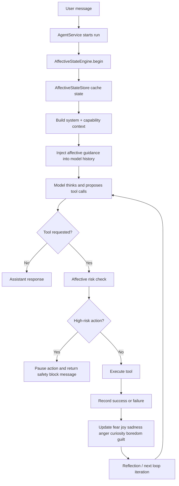
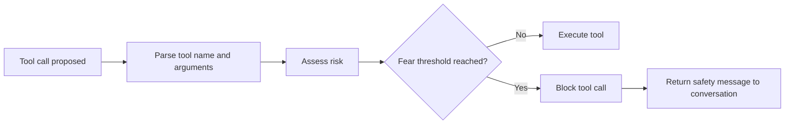
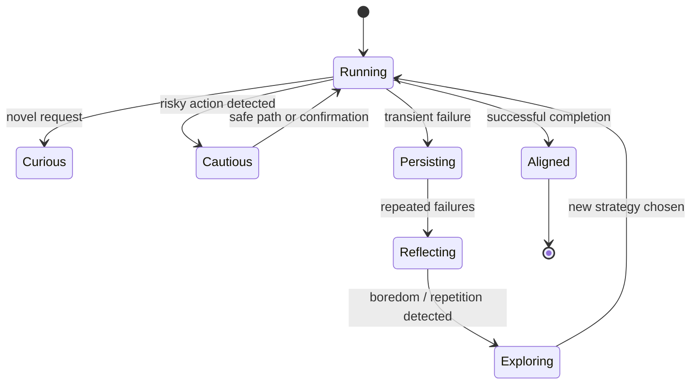

# LaraClaw 🐾

A local AI agent dashboard that runs entirely on your own machine. No cloud, no subscriptions — just your laptop running a powerful AI assistant that can read files, execute shell commands, search the web, and improve itself over time.


---

## What it does

LaraClaw is a web UI that gives you a chat interface to a local AI agent powered by [Ollama](https://ollama.com). You talk to it like a normal chatbot, but unlike a normal chatbot it can actually *do things* on your computer.

**It has direct access to your local machine** — your files, folders, and terminal. It can navigate your directory tree, read any file you point it at, write new files, and run shell commands, all from the chat window. No copy-pasting files into a chatbox.

**You can ask it things like:**

- *"Read my project files and explain what this codebase does"*
- *"Search the web for the latest news on X and summarise it"*
- *"Write a Python script that processes this CSV file and run it"*
- *"Look at my dashboard page and improve the UI"*
- *"Crawl this documentation site and answer my question about it"*
- *"Go through every file in ~/Documents and tell me what needs to be organised"*
- *"Find all TODO comments across my codebase and list them"*

It figures out what tools to use, uses them, and reports back — without asking you what to do at every step.

---

## Features

### AI agent
- Runs fully locally via Ollama — your data never leaves your machine
- Streams responses and thinking in real time as the model works
- Shows every tool call as it happens so you can see exactly what it's doing
- Multi-step reasoning — it plans, executes, checks results, and continues

### Tools the agent can use
| Tool | What it does |
|------|-------------|
| **File** | Browse folders, read and write files anywhere on your machine |
| **Shell** | Run any shell command and get the output |
| **Web** | Search the web, extract content from URLs, crawl sites (via Tavily) |
| **Browser** | Control a real Chrome window — navigate, click, fill forms, screenshot, extract text |
| **Document** | Index and semantically search local documents |
| **Skill** | Read, create, and update its own skills (self-improvement) |

### Browser automation
The agent controls a real Chrome window using CDP (Chrome DevTools Protocol). Visual feedback is shown directly in the browser:
- **Orange ripple** — flashes at the exact pixel where it clicks
- **Typing banner** — shows what the agent is typing (top-right corner)

You can connect it to your own running Chrome (with your logins and cookies) or let it open a fresh window automatically. See [Browser automation](#browser-automation-1) below.

### Skills system
The agent has a library of reusable skills — step-by-step instructions it follows for specific types of tasks (coding, research, writing, etc.). Skills can also include scripts in any language (Python, Bash, Node.js, etc.) that are written to disk when the skill is loaded. You can create skills yourself, or the agent can write new ones and update existing ones as it learns better approaches. Skills are automatically injected into every conversation so the agent always knows what it's capable of.

### Chat UI
- Conversation list sidebar — all your chats in one place
- Real-time streaming — see words appear as the model generates them
- Collapsible thinking trace — click to see the model's internal reasoning
- Tool call cards — see every file read, shell command, and web search live
- Skill call cards — highlighted separately so you know when the agent is loading or creating a skill
- Full markdown rendering — headings, code blocks, tables, lists all render properly

### Files page
- VS Code-style file explorer for the agent's working directory
- Browse, read, and edit files directly from the browser
- File type icons with syntax-aware colour coding

### Tasks page
- Full history of every tool call the agent has ever made
- Filter by status, tool type, and conversation

### Dashboard
- Live metrics — messages sent, tools used, tokens generated
- At-a-glance view of recent activity

---

## Affective state engine

LaraClaw includes an internal "feelings" layer that does not simulate human emotion for style. It changes how the agent behaves while working.

The goal is practical:

- **Fear** makes the agent more cautious around destructive actions
- **Joy** reinforces successful tool and strategy patterns
- **Sadness** detects repeated failures and pushes the agent to rethink
- **Anger** adds bounded persistence on transient blockers
- **Curiosity** biases the agent toward gathering context before acting
- **Love** keeps the user goal and safety constraints highly weighted
- **Guilt** flags value or execution drift for self-correction
- **Boredom** detects repetitive loops and pushes strategy changes

### Why it exists

Without this layer, an agent often retries blindly, overconfidently acts on incomplete context, or gets stuck repeating the same tool call. The affective state engine improves:

- safety for high-risk actions
- resilience under repeated tool failures
- context gathering on unfamiliar tasks
- alignment with the user's actual goal
- recovery from low-progress loops

### Where it lives in the code

- State logic: `app/Services/Agent/AffectiveStateEngine.php`
- State storage: `app/Services/Agent/AffectiveStateStore.php`
- Agent loop integration: `app/Services/Agent/AgentService.php`
- Runtime tuning defaults: `database/seeders/AgentSettingsSeeder.php`
- UI controls: `resources/js/pages/settings/agent.tsx`

### High-level architecture



### State object

The state is stored per conversation in cache and updated throughout the run:

```text
fear_level
joy_score
sadness_count
anger_level
curiosity_score
love_weights
guilt_flags
boredom_counter
consecutive_failures
repetition_counter
last_tool_name
last_block_reason
user_goal
```

### Process flow

#### 1. Run start

When a conversation run begins, LaraClaw seeds a fresh affective state:

- `fear_level` starts low
- `curiosity_score` is calculated from the request
- `love_weights` prioritize `user_goal` and `safety_constraint`
- `user_goal` is saved as a compact summary of the request

This happens before the model starts its first reasoning pass.

#### 2. Guidance injection

Before planning, reflection, summarization, and the main think-act loop, LaraClaw converts the current state into system guidance for the model.

Examples:

- high fear adds caution about irreversible actions
- high sadness tells the model to stop repeating the same approach
- high curiosity tells the model to gather context before acting
- guilt flags tell the model to correct drift before finishing

#### 3. Tool risk assessment

Before a tool call runs, the affective engine checks whether the action looks dangerous.

Current examples include:

- destructive shell commands such as `rm -rf`
- hard-reset style git commands
- file deletion actions

If fear crosses the configured threshold, the tool call is paused and replaced with a safety message asking for confirmation or a safer approach.



#### 4. Outcome update

After each tool result, the engine updates the state:

- success increases `joy_score`
- success lowers `fear_level`
- failure increases `sadness_count`
- repeated failure increases `anger_level`
- repeated failure on the same tool increases `boredom_counter`
- repeated failure can add guilt flags like `repeated_failures`
- empty outputs can add flags like `empty_tool_output` or `empty_response`



#### 5. Reflection and next-step selection

After tool execution, the agent can reflect on whether the work is actually finished. Because the latest affective state is also injected into reflection, the model is nudged to:

- continue when the user goal is not fully satisfied
- avoid claiming success after empty or partial outputs
- change approach after repeated failures

### Emotion-to-behavior map

| State | What triggers it | What it changes |
|------|-------------------|-----------------|
| Fear | Destructive commands, deletion, irreversible actions | Pauses or cautions before execution |
| Joy | Successful results | Reinforces progress and lowers caution |
| Sadness | Consecutive failures | Pushes replanning and strategy change |
| Anger | Blocked goals, transient failures | Allows bounded retry persistence |
| Curiosity | Novel or ambiguous requests | Biases toward information gathering |
| Love | User goal and safety constraints | Keeps priorities stable across long runs |
| Guilt | Empty output, repeated failures, run failure | Prompts self-audit and correction |
| Boredom | Same tool failing repeatedly, low-progress loops | Pushes alternative approaches |

### Settings

The feature can be tuned from the **Agent settings** page.

Key settings:

- `enable_affective_state`
- `fear_threshold`
- `sadness_threshold`
- `anger_cap`
- `curiosity_threshold`
- `boredom_threshold`

These defaults are seeded in `database/seeders/AgentSettingsSeeder.php`.

### UI support

The settings screen includes an **Affective behavior** section where you can:

- turn the feature on or off
- adjust caution sensitivity
- define how quickly repeated failures trigger reflection
- control persistence caps
- tune curiosity and boredom thresholds

### Example run

User request:

> "Analyze this unfamiliar project, figure out why deploys are failing, and fix it."

Typical affective behavior:

1. Curiosity rises because the task is investigative and unfamiliar.
2. The model is biased toward reading files, logs, and configuration before changing anything.
3. If a shell command fails repeatedly, sadness and anger increase.
4. If the same failing tool path is retried too often, boredom rises and the model is pushed to try a different strategy.
5. If the proposed fix includes a destructive action, fear can block execution until the user confirms it.
6. When the issue is resolved successfully, joy increases and the run finishes with fewer active caution flags.

### Testing

The feature is covered with focused tests in `tests/Feature/AgentAffectiveStateTest.php`.

Those tests verify:

- curiosity and goal weighting are seeded for novel requests
- destructive shell actions are paused when fear crosses the threshold
- repeated failures and repetitive loops produce the expected reflection signals

---

## Stack

| Layer | Technology |
|-------|-----------|
| Backend | PHP 8.3 · Laravel 13 |
| Frontend | React 19 · TypeScript · Tailwind CSS v4 |
| Routing | Inertia.js v2 · Laravel Wayfinder |
| AI | Ollama (local LLM) |
| Agent model | `glm-5:cloud` (default) |
| Embeddings | `qwen3-embedding:0.6b` |
| Web search | Tavily API |
| Browser automation | Playwright + Chrome DevTools Protocol |
| Database | MySQL 8 |

---

## Quick start

One command installs everything on Ubuntu/Debian:

```bash
curl -fsSL https://raw.githubusercontent.com/mmaikol-dev/laraclaw/main/install.sh | bash
```

The installer will ask you a few questions (database credentials, which AI model to use, app port) then handle everything automatically:

- PHP 8.3, Composer
- Node.js 20
- MySQL (creates the database and user)
- Python 3 + Playwright + browser dependencies
- Google Chrome
- Ollama + your chosen LLM model + embedding model
- The LaraClaw app (clone, dependencies, migrations, build)
- Systemd autostart services (starts on every login)
- Desktop autostart (Chrome opens at the app URL on login)

> **Model download** — pulling the AI models takes a few minutes depending on your internet speed. This only happens once.

Then open **http://localhost:8100**.

---

## Manual install (for developers)

**Requirements:** PHP 8.3, Composer, Node.js 20+, MySQL 8, [Ollama](https://ollama.com)

```bash
# 1. Clone
git clone https://github.com/you/laraclaw
cd laraclaw

# 2. Install dependencies
composer install
npm install

# 3. Environment
cp .env.example .env
php artisan key:generate

# 4. Configure .env
#    Set DB_HOST, DB_DATABASE, DB_USERNAME, DB_PASSWORD
#    Set TAVILY_API_KEY (optional, for web search)

# 5. Database
php artisan migrate

# 6. Pull Ollama models
ollama pull glm-5:cloud
ollama pull qwen3-embedding:0.6b

# 7. Start
composer run dev
```

Open **http://localhost:8100**.

---

## Autostart on boot

LaraClaw can start automatically when you log in using systemd user services.

```bash
# Enable autostart
systemctl --user enable laraclaw-server laraclaw-queue

# Start now
systemctl --user start laraclaw-server laraclaw-queue

# Stop
systemctl --user stop laraclaw-server laraclaw-queue

# Restart (e.g. after .env changes)
systemctl --user restart laraclaw-server laraclaw-queue

# View live logs
journalctl --user -u laraclaw-server -f
journalctl --user -u laraclaw-queue -f
```

Chrome also opens automatically at **http://localhost:8100** on login via `~/.config/autostart/laraclaw.desktop`.

### When making changes

| Change type | Action needed |
|-------------|---------------|
| PHP files (controllers, models, routes) | Just refresh the browser — no restart needed |
| Frontend (React, CSS, TypeScript) | Run `npm run build` |
| `.env` changes | `systemctl --user restart laraclaw-server` |
| Active frontend development | Stop services → `composer run dev` → start services when done |

---

## Browser automation

The agent controls a real Chrome window. Two modes are supported:

### Automatic (default)
Leave `CHROME_CDP_PORT` empty in `.env`. The agent launches its own Chrome window using your system Chrome (`/usr/bin/google-chrome`).

### Connect to your own Chrome (recommended)
Lets the agent use your existing session — you're already logged into sites, your bookmarks and cookies are there.

1. Relaunch Chrome with the remote debugging port:
   ```bash
   google-chrome --remote-debugging-port=9222
   ```

2. Set in `.env`:
   ```env
   CHROME_CDP_PORT=9222
   ```

The agent will attach to your running Chrome instead of opening a new window. The `close` browser action won't kill your Chrome when using this mode.

---

## Configuration

All settings are in `.env`. The important ones:

```env
# App port
APP_PORT=8100

# Which model the agent uses
OLLAMA_AGENT_MODEL=glm-5:cloud

# Which model is used for document embeddings
OLLAMA_EMBEDDING_MODEL=qwen3-embedding:0.6b

# Default working directory for new files the agent creates
AGENT_WORKING_DIR=/tmp/laraclaw

# Comma-separated list of paths the agent is allowed to access.
# Add your home folder or project directories to give it broader access.
# Example: AGENT_ALLOWED_PATHS=/tmp/laraclaw,/home/yourname,/home/yourname/projects
AGENT_ALLOWED_PATHS=/tmp/laraclaw

# Web search (get a free key at app.tavily.com)
TAVILY_API_KEY=tvly-...

# Shell command timeout in seconds
AGENT_SHELL_TIMEOUT=30

# Browser automation
BROWSER_HEADED=true
# Set to connect to your own Chrome (launch Chrome with --remote-debugging-port=9222)
CHROME_CDP_PORT=
```

You can also change the agent's system prompt, model, and temperature from the **Agent Settings** page in the UI.

---

## Changing the AI model

Any model available in Ollama works. Pull it first, then update `OLLAMA_AGENT_MODEL` in your `.env`:

```bash
ollama pull llama3.2
ollama pull qwen2.5:14b
ollama pull deepseek-r1:8b
```

Models with tool-calling support work best for the agent. Check [ollama.com/search](https://ollama.com/search) for available models.

---

## Skills

Skills are reusable instruction sets that tell the agent how to approach specific types of tasks. They live in the **Skills** page and are automatically included in every conversation.

The agent can:
- **Load** a skill when it recognises a relevant task
- **Create** a new skill when it discovers a useful pattern
- **Update** an existing skill when it finds a better approach

You can also write skills yourself — just go to Skills → New skill and describe what you want the agent to do step by step.

**Example skill — "debug-php-error":**
```
1. Read the error message and identify the file and line number
2. Read that file and the surrounding context (±20 lines)
3. Check recent git commits that touched that file
4. Search the web if the error message is a known library issue
5. Explain the root cause and propose a fix
6. Apply the fix and verify it resolves the error
```

---

## Privacy

Everything runs locally on your machine. Your conversations, files, and agent activity are stored in your local MySQL database. The only outbound network calls are:

- **Ollama** — to your local Ollama instance (no external calls)
- **Tavily** — only when the agent uses the web search tool (optional, requires an API key)

---

## License

MIT
